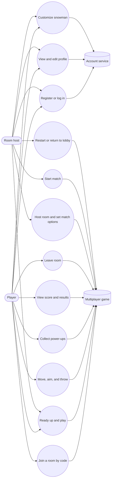

# Use cases

```mermaid
flowchart LR
    Player([Player])
    Host([Room host])
    Account[(Account service)]
    Game[(Multiplayer game)]

    Player --> UC1((Register or log in))
    Player --> UC2((View and edit profile))
    Player --> UC3((Customize snowman))
    Player --> UC4((Join a room by code))
    Player --> UC5((Ready up and play))
    Player --> UC6((Move, aim, and throw))
    Player --> UC7((Collect power-ups))
    Player --> UC8((View score and results))
    Player --> UC9((Leave room))

    Host --> UC1
    Host --> UC2
    Host --> UC3
    Host --> UC5
    Host --> UC10((Host room and set match options))
    Host --> UC11((Start match))
    Host --> UC12((Restart or return to lobby))

    UC1 --> Account
    UC2 --> Account
    UC3 --> Account
    UC4 --> Game
    UC5 --> Game
    UC6 --> Game
    UC7 --> Game
    UC8 --> Game
    UC9 --> Game
    UC10 --> Game
    UC11 --> Game
    UC12 --> Game
```

Room creation, match start, restart, and return-to-lobby actions are checked on the Java server. Only the host can change room options or control match transitions.
